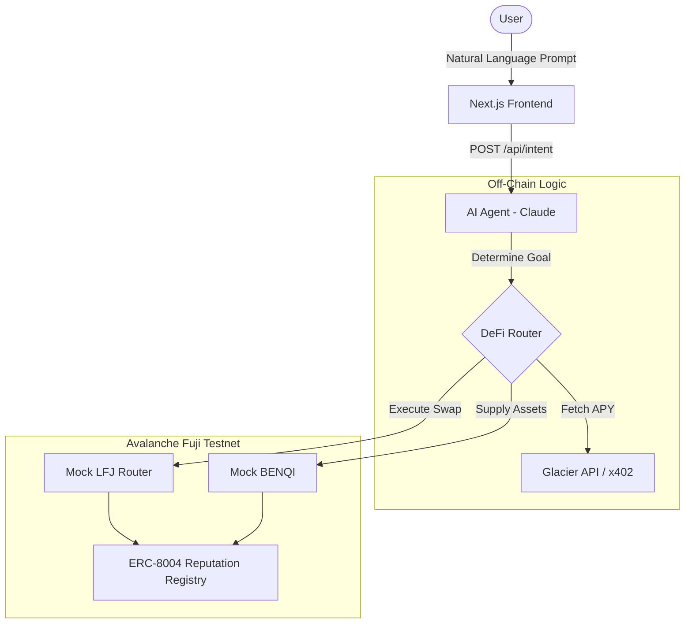

# Talk-To-Defi 🤖💹

An AI-powered DeFi agent that lets you interact with Avalanche DeFi protocols using natural language. Built with Next.js, Claude 3.5 Sonnet, and Ethers.js.

## 🏗 Architecture

The system uses an autonomous AI agent to parse natural language intents, query live on-chain yield rates via Glacier API, execute smart contract transactions (swaps/supplies), and write performance feedback to an ERC-8004 Reputation Registry.



## 📂 File Structure

```text
Talk-To-Defi/
├── contracts/                  # Hardhat project for Mock DeFi Contracts
│   ├── contracts/
│   │   ├── MockBENQI.sol       # Mock qiUSDC Lending Market
│   │   ├── MockERC8004.sol     # Agent Identity & Reputation Registry
│   │   ├── MockLFJRouter.sol   # Mock AMM for swapping AVAX -> USDC
│   │   └── MockUSDC.sol        # Testnet USDC
│   └── scripts/
│       └── deploy.ts           # Fuji Testnet Deployment Script
│
├── frontend/                   # Next.js Application
│   ├── app/
│   │   ├── api/                # Next.js API Routes (Agent, Intents, APY)
│   │   └── dashboard/          # Chat Interface UI
│   ├── components/             # React Components (ChatWindow, StepTrace, Receipt)
│   └── lib/                    # Core Logic
│       ├── agent-wallet.ts     # Ethers.js Wallet instantiation
│       ├── benqi.ts            # BENQI Protocol Integration
│       ├── claude.ts           # Anthropic API Wrapper
│       ├── defi-router.ts      # Multi-step Agent Routing Logic
│       ├── erc8004.ts          # Identity/Reputation Management
│       ├── glacier.ts          # Avalanche Glacier API client
│       ├── lfj.ts              # Trader Joe Protocol Integration
│       └── x402-client.ts      # L402 / x402 Payment Client
│
└── README.md                   # This file
```

## 🚀 Getting Started

1. Set up your `.env.local` inside the `frontend/` directory (see `frontend/.env.example`).
2. Run the development server:
```bash
cd frontend
npm install
npm run dev
```
3. Open [http://localhost:3000/dashboard](http://localhost:3000/dashboard) to interact with the agent.
